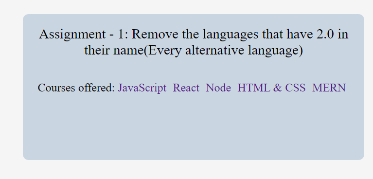
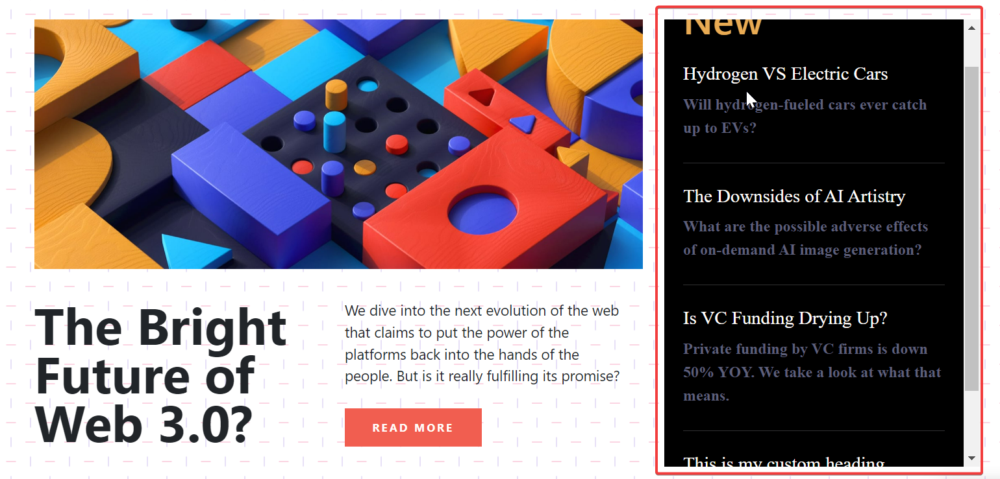
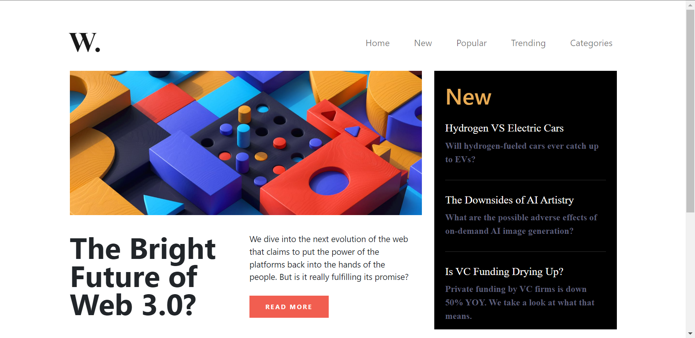
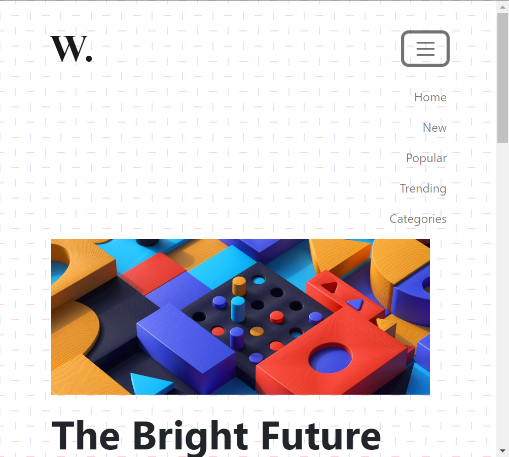
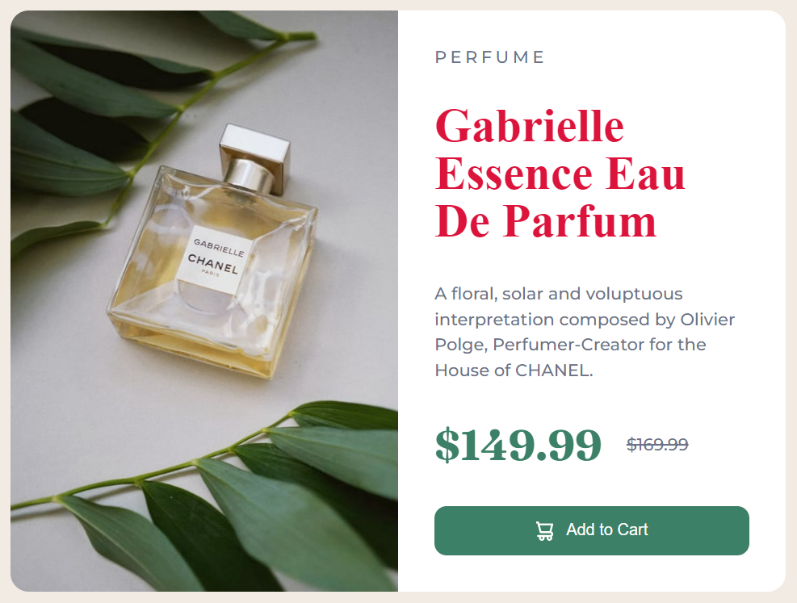

# JavaScript DOM Assignment

## JavaScript DOM Projects 1,2,3

<br>

### <b>Project 1 :-</b>

<br>

#### <b> Task 1 :-</b>
<p>The user has to append a new element in the navigation menu named "Hire Me" after the "Projects".

<br>

##### <b>After Update :</b>


<br>

##### <b> Solution :- </b>

```javascript
//task 1 , project 1

//editing li
var ans=document.querySelectorAll("nav ul li");
ans[2].innerText="Projects";

//creating new li
var ans2=document.createElement("li");
ans2.innerText="Hire Me";
var ans3=document.querySelector("nav ul");
ans3.append(ans2);
```
<br>

#### <b> Task 2 :-</b>
<p>The user has to append a new element in the navigation menu named "Hire Me" after the "Projects" and change Placeholder text.

##### <b>After Update :</b>


##### <b> Solution :- </b>

```javascript
//task 2 ,project 1
var ans=document.querySelectorAll("nav ul li");
ans[2].innerText="Projects";

var ans2=document.querySelector(".search-field");
ans2.outerText="Search My Project";
// ans2.outerText="j";
// console.log(ans2);
```

<br>

#### <b> Task 3 :-</b>
<p>The user has to change element in navigation menu named "Contact" to "Projects" and change few words from paragraph. </p>

<br>

##### <b>After Update :-</b>


<br>

##### <b>Solution :-</b>

```javascript
//task 3 , project 1
var ans=document.querySelectorAll("nav ul li");
ans[2].innerText="Projects";

var ans2=document.querySelectorAll("section div p span");
// console.log(ans2);
ans2[1].innerText="an Employee";
ans2[2].innerText="iNeuron Intelligence Pvt Ltd."
```

<br>

#### <b> Task 4 :-</b>
<p>The user has to change element in navigation menu named "Contact" to "Projects" and change Image.</p>

<br>

##### <b>After Update :-</b>


<br>

##### <b>Solution :-</b>

```javascript
//task 4 , project 1
var ans=document.querySelectorAll("nav ul li");
ans[2].innerText="Projects";

var ans2=document.querySelectorAll("section div img");
ans2[0].src="https://hiteshchoudhary.com/static/a8d73d1aac4c79e9bb689640e6090367/2eaab/person-image.jpg"
```

<br>

#### <b> Task 5 :-</b>
<p>The user has to change element in navigation menu named "Contact" to "Projects" and change Image.</p>

<br>

##### <b>After Update :-</b>


<br>

##### <b>Solution :-</b>

```javascript
//task 5 , project 1
var ans=document.querySelectorAll("nav ul li");
ans[2].innerText="Projects";

var ans2=document.createElement("button");
ans2.innerText="Support Me";
var ans3=document.querySelector(".hero-right-section-btns");
ans3.appendChild(ans2);
```
<br>
<hr>
<br>

### <b> Project 2 </b>

<br>

#### <b> Task 1 :-</b>
<p>The user has to change element in navigation menu named "Contact" to "Projects".
</p>

<br>

##### <b> After Update :- </b>

<br>

##### <b> Solution :- </b>

```javascript
//task 1, project 2
var ans=document.querySelectorAll("nav ul li");
ans[2].innerText="Projects";
```

<br>

#### <b> Task 2 :-</b>
<p>The user has to change details in About page.
</p>

<br>

##### <b> After Update :- </b>

<br>

##### <b> Solution :- </b>

```javascript
//task 2, project 2
var ans=document.querySelectorAll("nav ul li");
ans[2].innerText="Projects";

var ans2=document.querySelector(".accordian-wrapper");
// console.log(ans2);
var newdiv=document.createElement("div");
newdiv.className="accordian";
ans2.appendChild(newdiv);
var h=document.createElement("h3");
h.innerText="Skills";
var p=document.createElement("p");
p.innerText="I posses a very good command over the Full Stack Development technologies like MERN which can be seen on my GitHub profile.";
newdiv.appendChild(h);
newdiv.appendChild(p);
```
<br>
<hr>
<br>

### <b> Project 3 </b>

<br>

#### <b> Task 1 :-</b>
<p>User has to change placeholder texts in all fields of Contact Page.
</p>

<br>

##### <b> After Update :-</b>


<br>

##### <b> Solution :- </b>

```javascript
//task 1 , project 3
var ans=document.getElementsByClassName("mainLeftDetails");
// console.log(ans[0][1].placeholder);
ans[0][0].placeholder="FSJS 2.0"
ans[0][1].placeholder="fsjs@ineuron.ai"
ans[0][2].placeholder="Hello World"

var ans2=document.getElementsByTagName("form");
// console.log(ans[0][1].placeholder);
ans2[1][0].placeholder="FSJS 2.0"
ans2[1][1].placeholder="fsjs@ineuron.ai"
ans2[1][2].placeholder="Hello World"
console.log(ans2);
```

<br>
<hr>
<br>

## JavaScript DOM Project 4
<br>

#### <b> Task 1 :-</b>
<p>User need to change the background color of footer of each card.
</p>

<br>

##### <b> After Update :-</b>


<br>

##### <b> Solution :- </b>

```javascript
//task 1 , project 4
var barbarian=document.querySelector(".clash-card__unit-stats--barbarian");
barbarian.style.backgroundColor="yellow";
var archer=document.querySelector(".clash-card__unit-stats--archer");
archer.style.backgroundColor='pink';
var giant=document.querySelector(".clash-card__unit-stats--giant");
giant.style.backgroundColor="orange";
var goblin=document.querySelector(".clash-card__unit-stats--goblin");
goblin.style.backgroundColor="green";
var wizard=document.querySelector(".clash-card__unit-stats--wizard");
wizard.style.backgroundColor="blue";
```

<br>
<hr>
<br>

## JavaScript DOM Project 5
<br>

#### <b> Task 1 :-</b>
<p>User needs to add 1 more category in left column, 1 blank card and 1 more button in nav bar. </p>

<br>

##### <b>After Update :-</b>


<br>

##### <b>Solution :-</b>
```javascript
//task 1 , project 5

//for adding 1 more category
var ans = document.querySelector(".tags-container div");
console.log(ans);
var res=document.createElement("a");
res.innerText="Chinese (7)";
res.href="#"
ans.appendChild(res);

//for adding 1 more button
var btn = document.querySelectorAll(".nav-center div")
console.log(btn[2]);
var result=document.createElement("a");
result.innerText="Pro Subscription";
result.href="#";
result.className="btn";
btn[2].appendChild(result);
```
<br>
<hr>
<br>

## JavaScript DOM Project 6
<br>

#### <b> Task 1 :-</b>
<p>User needs to change the header image logo.
</p>

<br>

##### <b> After Update:- </b>


<br>

##### <b> Solution :- </b>
```javascript
//task 1 , project 6

var ans=document.querySelector("header img");
console.log(ans);
ans.src="./assets/ineuron-logo.png"
console.log(ans.src);
```

<br>

#### <b> Task 2 :-</b>
<p>User need to change the amount in the card and add LinkedIN logo in footer.</p>

<br>

##### <b> After Update:- </b>


<br>

##### <b> Solution :- </b>
```javascript
//task2 , project 6

var ans=document.querySelector(".app_price span");
console.log(ans);
ans.innerText="10";
console.log(ans);

var foot=document.querySelector(".footer_social");
var neww=document.createElement("div");
neww.className="footer_social_ico";
var dd=document.createElement("i");
dd.className="fa-brands fa-linkedin";
neww.appendChild(dd);
foot.appendChild(neww);
console.log(foot);
```
<br>
<hr>
<br>

## JavaScript DOM Project 7
<br>

#### <b> Task 1 :-</b>
<p>User needs to remove the languages having 2.0 with them.
</p>

<br>

##### <b> After Update:- </b>


<br>

##### <b> Solution :- </b>
```javascript
//task 1 , project 7
var ans=document.querySelectorAll(".main__languages a");
console.log(ans);
var ans2=document.querySelector(".main__languages");
var newarray=[];
for(let i=0;i<ans.length;i++){
    newarray.push(ans[i]);
    if(ans[i].innerText.includes('2')){
        ans2.removeChild(ans[i]);
    }
    // console.log(ans[i].innerHTML);
}
```
<br>

#### <b> Task 2 :-</b>
<p>User needs to enable the input field and submit button and on click of submit the page should refresh.
</p>

<br>

##### <b> After Update:- </b>


<br>

##### <b> Solution :- </b>
```javascript
//task 2 , project 7

var res=document.querySelectorAll("form")[0][0];
var res1=document.querySelectorAll("form")[0][1];
// console.log(res);
// res.dis
res.disabled=false;
res1.disabled=false;

var btn=document.getElementsByClassName("main__form-btn");
console.log(ans[0]);
// ans2.removeChild(ans[0]);

btn.addEventListener("click",()=>{
    window.location.reload();
})  
```
<br>
<hr>
<br>

## JavaScript DOM Project 8
<br>

#### <b> Task 1 :-</b>
<p>User has to add 1 more heading in the right column in scrolling way.</p>

<br>

##### <b> After Update :- </b>


<br>

##### <b> Solution :- </b>
```javascript
//Project08_Task01

var ans=document.getElementsByClassName("col-lg-4 new");
var res=document.getElementsByTagName("aside");
// res[0].style.height="650px";
res[0].style.overflowY="scroll";
res[0].style.overflowX="scroll";
console.log(res);
console.log(res[0].style);
var ans2=document.createElement("h2");
ans2.innerText="This is my custom heading";
ans2.className="new-head";
var ans4=document.createElement("hr");
ans4.className="hr-line"
ans[0].appendChild(ans4);
ans[0].appendChild(ans2);
var ans3=document.createElement("p");
ans3.innerText="My name is Madhav Sahi";
ans3.className="new-p";
ans[0].appendChild(ans3);
// console.log(ans[0]);
```
<br>

#### <b> Task 2 :-</b>
<p>User has to change background image of page.</p>

<br>

##### <b> After Update :- </b>


<br>

##### <b> Solution :- </b>
```javascript
//Project08_Task02

var ans=document.getElementsByTagName("body");
console.log(ans);
ans[0].style.backgroundImage="none";
```
<br>

#### <b> Task 3 :-</b>
<p>User has to add  nav links on click of hamburger menu in nav menu according to screen size.</p>

<br>

##### <b> After Update :- </b>


<br>

##### <b> Solution :- </b>
```javascript
//Project08_Task03

//collapse is the bootstrap class to hide and unhide on toggle.
// javascript toggle is used to swtich between that class.
let ans = document.querySelector(".navbar-toggler");
ans.addEventListener("click",()=>{
        document.querySelector("#navbarTogglerDemo01").classList.toggle("collapse");
    })
```
<br>
<hr>
<br>

## JavaScript DOM Project 9
<br>

#### <b> Task 1 :-</b>
<p>User needs to change the color of the big heading.</p>
<br>

##### <b> After Update :- </b>


<br>

##### <b> Solution :- </b>
```javascript
//Project09_Task01

var ans=document.getElementsByClassName("caption");
console.log(ans[0]);
var ans2=ans[0].getElementsByClassName("title");
console.log(ans2[0]);
ans2[0].style.color="red";
```
<br>

#### <b> Task 2 :-</b>
<p>User needs to change the background color of Cart button.</p>
<br>

##### <b> After Update :- </b>

<br>

##### <b> Solution :- </b>
```javascript
//Project09_Task02

var btn=document.getElementsByClassName("add-to-cart");

btn[0].style.backgroundColor="red";
btn[0].addEventListener("mouseover",()=>{
    btn[0].style.backgroundColor="red";
})
```

<br>
<hr>