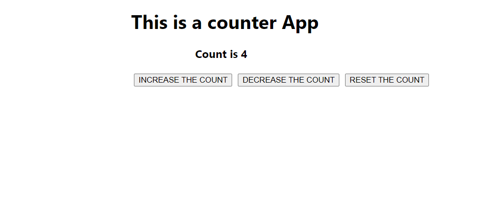

# Counter App using React JS

This project was bootstrapped with [Create React App](https://github.com/facebook/create-react-app).

## 📌 To Run the Application:-

### `npm start`
- It runs the app in the development mode.

## 📌 Live Site : [Counter App](https://counterapp-reactjs-madhavsahi.netlify.app/ "Live Link")

## 📌 Brief about App

- The project is a Counter App implemented using React JS.
- It is a web-based application where user can increment or decrement the count by 1. 
- User can also reset the count to 0 at any time. 
- The interface is built using React components and styled using plain CSS.
 

 

## 📌 Tech Stack

 

## 📌 Overview

 