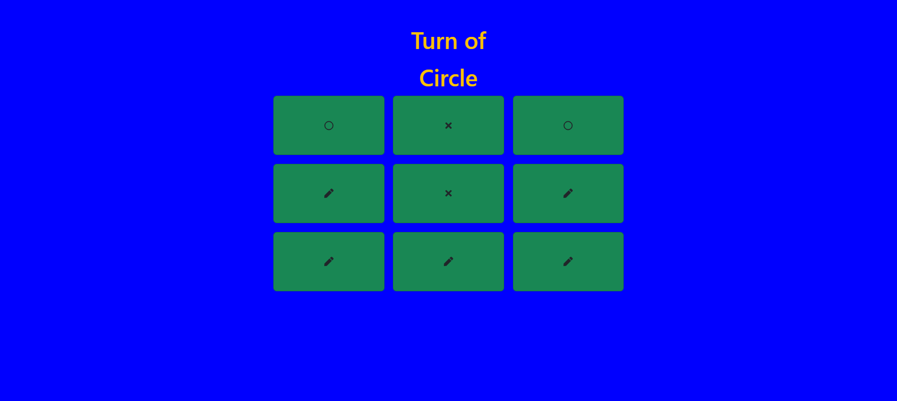

# Tic-Tac-Toe using React JS Class Based Component

This project was bootstrapped with [Create React App](https://github.com/facebook/create-react-app).

## 📌 To Run the Application:-

### `npm start`
- It runs the app in the development mode.

## 📌 Live Site : [Tic-Tac-Toe](https://tic-tac-toe-reactjs-madhavsahi.netlify.app/ "Live Link")

## 📌 Brief about App

The project is a Tic Tac Toe game implemented using React JS Class Based component. It is a web-based application where users can play the classic game of Tic Tac Toe against each other. The game interface is built using React components and styled using Bootstrap and React-Icons.

The main features of the application include:

- `Game Logic`: The game follows the standard rules of Tic Tac Toe. Players take turns marking empty cells on a 3x3 grid, aiming to create a line of their respective symbols (either crosses or circles) horizontally, vertically, or diagonally. The game tracks the current player and determines the winner or a draw.

- `Interactive Interface`: The application provides an interactive user interface where players can click on the empty cells to make their moves. The interface updates in real-time to reflect the current state of the game and display the symbols for each player.

- `Win Detection`: After each move, the application checks for a winning condition by examining the grid. If a player has formed a winning line, the game declares the winner and displays the Win message. If the game ends in a draw, it displays a message indicating the draw.

- `Restarting the Game`: At the end of a game, players have the option to restart the game by clicking the Reset button. This clears the board, resets the current player, and allows for a fresh gameplay.

- `Notifications`: The application provides visual feedback using toasts from the react-toastify library. Toast messages notify the players of game outcomes, such as a win or an attempt to make a move in an occupied cell.

- Overall, the project showcases the implementation of a classic game using React JS class based components, state management, and event handling. It provides an engaging user experience and demonstrates the power and flexibility of React JS for building interactive web applications.

 

## 📌 Tech Stack

 

## 📌 Overview

 