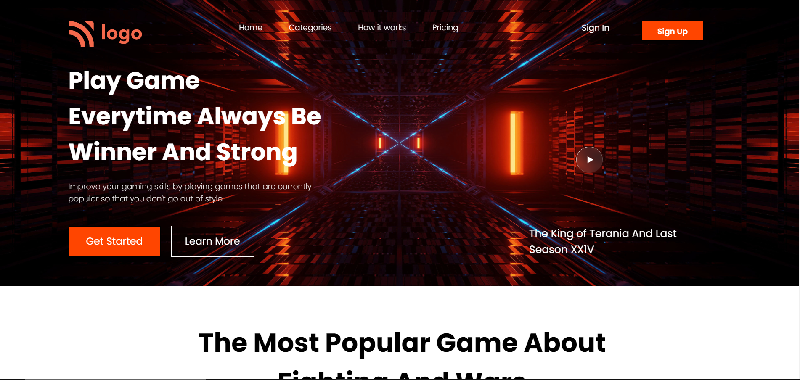

# Gaming Site Landing Page
 

### ⭕ The site is NOT responsive yet. ⭕

 

  

# 📌Live Site : [Visit Here](https://gamingsite-html-css-madhavsahi.netlify.app/ "Live Link")

 

# 📌 Tech Stack

 

# 📌 Overview

 

# 📌 My process
- At first I made a basic layout of what can be done to achieve the output.
- Then thought of what HTML , CSS elements and properties would be best to use to achieve the output.
- Thought of where to use image as background or directly.
- It took me 5 hours to build this landing page.

 

# 📌 Learnings
- Learnt how to make such complicated pages using just HTML and plain CSS.
- Learnt about CSS Positions - Relative , Absolute and used them.
- Learnt about CSS Selectors and how to use them to trigger elements.
- Learnt how to use CSS Flexbox.
- Explored about Flexbox parent and child properties.
- Explored more about justify-content and align-items properties.
- Learnt about CSS background-image properties and used them.
- Learnt how to Blur background using backdrop-filter.
- Learnt CSS Transform property to scale the element on hover.
- Learnt about CSS Filter property to adjust brightness,contrast,greysclae etc of element. 
- Learnt about CSS Hover effects.
- Learnt how to make vertical and horizontal lines just using CSS.
- Learnt how to build fluid layouts using FlexBox.
- Learnt hover, transform,filter and scale properties of CSS and applied it to the elements.
- Learnt how to develop full fledged landing page.

 

# 📌 Connect with Me
- My Gmail - madhavsahi16@gmail.com
- My LinkedIn - [LinkedIn - Madhav Sahi](https://www.linkedin.com/in/madhav-sahi-6a2305161/ "LinkedIn") 
- My GitHub - [GitHub - Madhav Sahi](https://github.com/MadhavSahi "GitHub")  
- My Twiiter - [Twitter - Madhav Sahi](https://twitter.com/Madhavvv_ "Twitter")  
- My Hashnode - [Hashnode - Madhav Sahi](https://madhavsahi.hashnode.dev/ "Hashnode")

 

# 📌 Acknowledgements

- Icons used for Tech Stack section :- [shields.io](https://img.shields.io)

