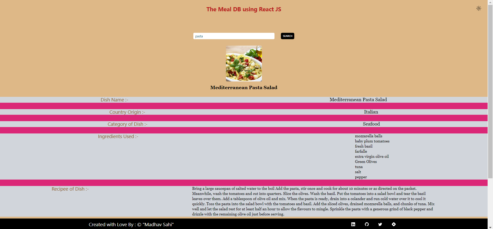

# The Meal DB 

  

## 📌Live Site : [Visit Here](https://react-mealdb-madhavsahi.netlify.app/ "Live Link")

 

## 📌 Tech Stack

 

## 📌 Overview

 

## 📌 My process

- Made a basic layout of how to add functionality using flowchart.
- Thought about how to structure the WebPage of project.
- Used useState hook to store the dyanmic values of input value.
- Used React-Router-DOM to navigate user from 1 component to other.
- Used Axios to get the data from Meal API.
- Used Nesting Router concept to use Outlet Module and have sub-routes.
- Used ContextAPI to send Props from 1 component to other.
- Used React-icons for more enhancement.
- Added Toggle Theme button so that user can switch from Light mode to Dark mode.
- Thought about which buttons to add and what logic should be implemented so that user experience is enhanced.
- Wrote CSS using Tailwind and added React-Icons from various libraries to beautify the WebPage.

 

## 📌 Acknowledgements

- Icons used for Tech Stack section :- [shields.io](https://img.shields.io)

