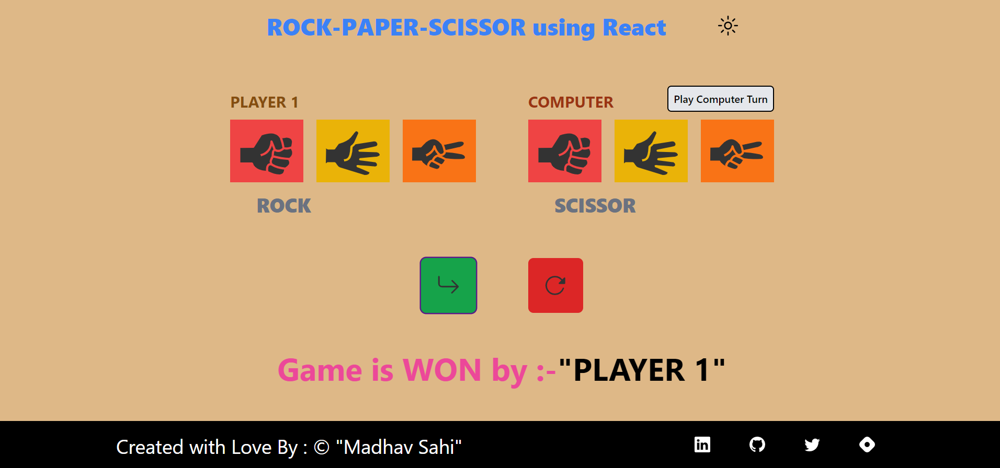

# Rock Paper Scissor App using ReactJS

  

## 📌Live Site : [Visit Here](https://react-rock-paper-scissor-madhavsahi.netlify.app/ "Live Link")

 

## 📌 Tech Stack

 

## 📌 Overview

 

## 📌 My process

- Made a basic layout of how to add functionality using flowchart.
- Thought about how to structure the WebPage of project.
- Used useState hook to store the dyanmic values of Player option and Computer option.
- Used useState hook to store value of Result using logic of how the game will be won by computer or player or  will be drawn.
- Added Submit and Reload buttons so that user doesn't need to reload the page again and again.  
- Added Toggle Theme button so that user can switch from Light mode to Dark mode.
- Wrote logic for how the User can select 1 option on its own and Computer will select any 1 random option.
- Thought about which buttons to add and what logic should be implemented so that user experience is enhanced.
- Wrote CSS using Tailwind and added Icons from various libraries to beautify the WebPage.

 

## 📌 Acknowledgements

- Icons used for Tech Stack section :- [shields.io](https://img.shields.io)

