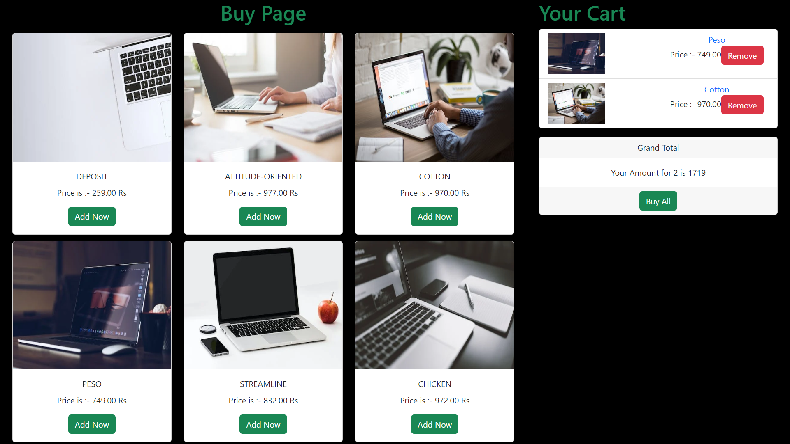

# Shopping Cart App using ReactJS

  

## 📌Live Site : [Visit Here]( "Live Link")

 

## 📌 Tech Stack

 

## 📌 Overview

 

## 📌 My process

- Made a basic layout of how to add functionality using flowchart.
- Thought about how to structure the WebPage of project.
- Used useState hook to store the values of all the products inside an array.
- Defined various methods that are required in App - Delete, Buy, Purchase.
- Used Axios to fetch the data from our own made API.
- Used useEffect hook to display the various products on display.
- Used React-Toastify to display various messages on boundary conditions.  
- Wrote logic for how the User can only add 1 product at once and can not add that product again.
- Thought about which buttons to add and what logic should be implemented so that user experience is enhanced.
- Wrote CSS using BootStrap and added Icons from various libraries to beautify the WebPage.
- Used Faker npm package to give each product some uniquq name and price.

 

## 📌 Acknowledgements

- Icons used for Tech Stack section :- [shields.io](https://img.shields.io)

