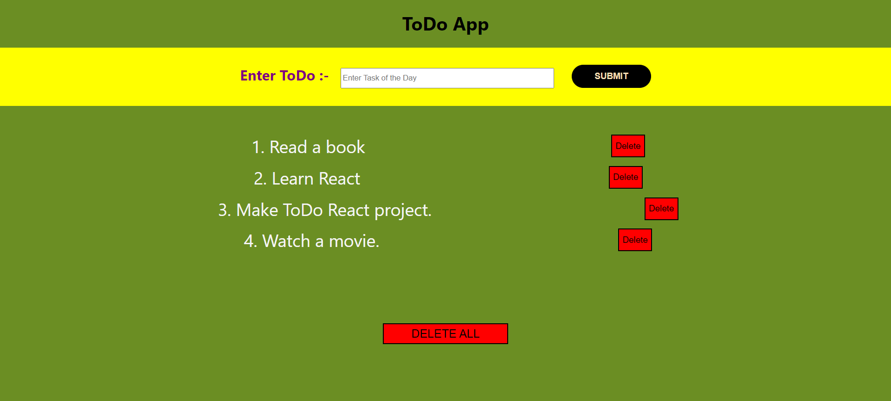

# ToDo App using ReactJS

  

## 📌Live Site : [Visit Here](https://react-todo-madhavsahi.netlify.app/ "Live Link")

 

## 📌 Tech Stack

 

## 📌 Overview

 

## 📌 My process

- Made a basic layout of how to add CRUD functionality using flowchart.
- Thought about how to structure the WebPage of project.
- Thought about which buttons to add and what logic should be implemented so that user experience is enhanced.
- Wrote code about logic of each functionality and implemented it on various buttons using React JS concepts.
- Wrote CSS to beautify the WebPage.

 

## 📌 Learnings

- Learnt about how to approach a ReactJS project.
- Learnt about how to use props and states inside components.
- Learnt about how to add any HTML and CSS based on our logic.
- Used concept of React States to define and update variables.
- Learnt about how to handle multiple functionality inside ReactJS project.
- Learnt how to delete a particular ToDo item and how to delete all the ToDos at once.

 

## 📌 Acknowledgements

- Icons used for Tech Stack section :- [shields.io](https://img.shields.io)

